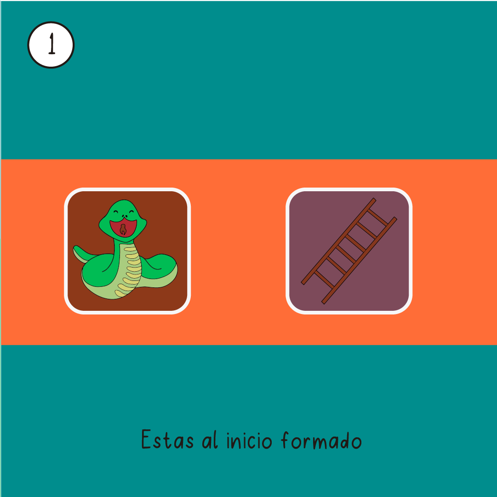
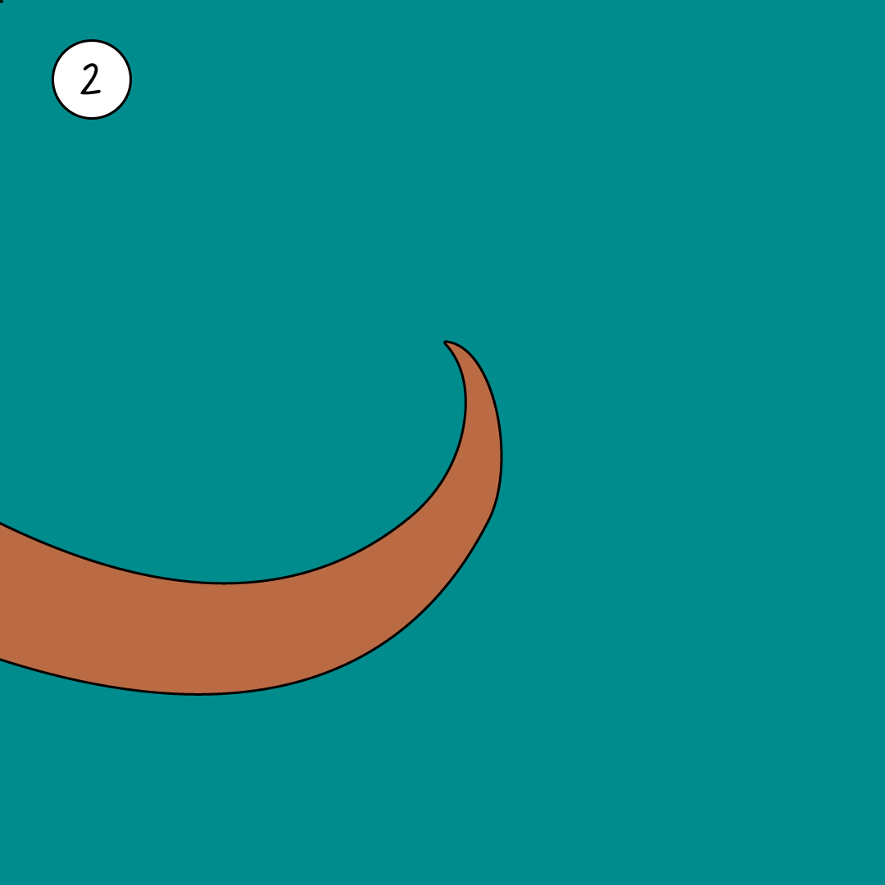
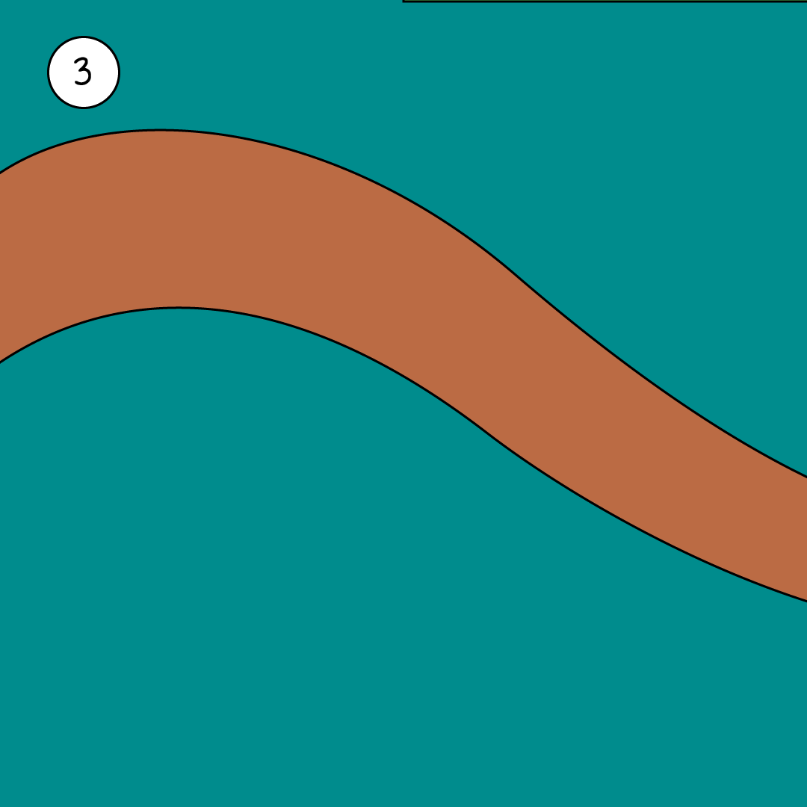
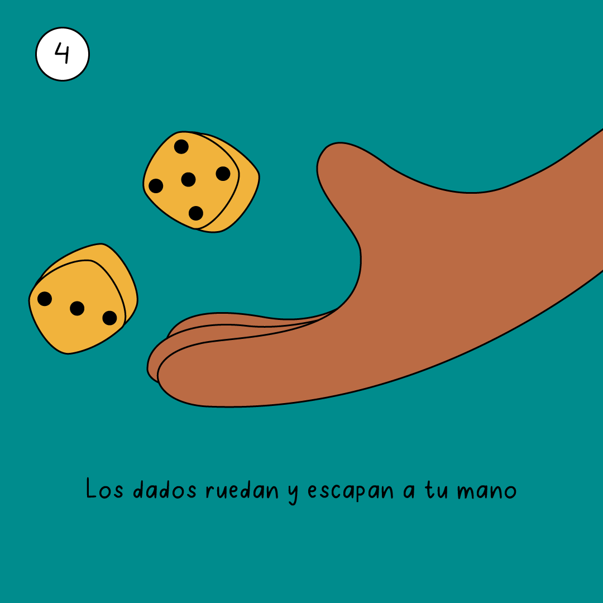
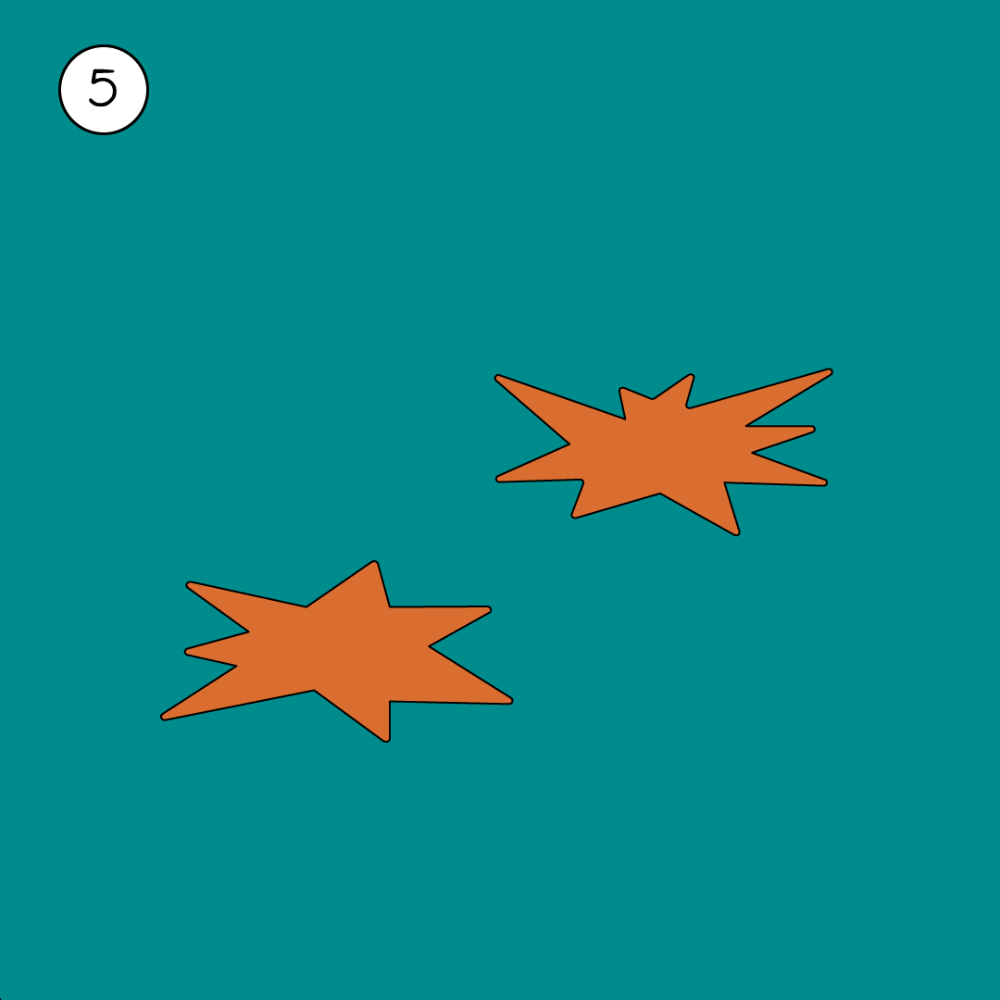

# Serpientes & Poemas 🎲📜

**Serpientes & Poemas** is a modern twist on the classic board game "Snakes and Ladders," enriched with poetic verses. Players roll the dice, navigate the board, and collect verses as they progress. The game is designed to be visually engaging and musically immersive, with a unique blend of art, poetry, and gameplay.

---

## Features ✨

- **Dynamic Gameplay**: Navigate a beautifully designed board with snakes and ladders.
- **Poetic Verses**: Collect verses as you land on specific spaces, creating a poetic journey.
- **Immersive Audio**: Background music and voice narration enhance the experience.
- **Device Adaptability**: Optimized for both iPhone and iPad with dynamic layouts.
- **Customizable Settings**: Mute/unmute soundtrack and voice narration as desired.

---

## Board Preview 🎲

Here’s a preview of the first 5 spaces on the board:

| Space 1 | Space 2 | Space 3 | Space 4 | Space 5 |
|---------|---------|---------|---------|---------|
|  |  |  |  |  |

---

## How to Play 🎮

1. **Start the Game**: Tap "Empezar" to begin your journey.
2. **Roll the Dice**: Tap the dice to roll and move your player.
3. **Collect Verses**: Land on special spaces to collect poetic verses.
4. **Reach the End**: Navigate through snakes and ladders to reach the final space and win the game.

---

## Technologies Used 🛠️

- **SwiftUI**: For building a responsive and visually appealing user interface.
- **Vortex**: Particle system for dynamic visual effects ([Vortex GitHub](https://github.com/twostraws/Vortex)).
- **AVFoundation**: For audio playback and voice narration.
- **Custom Fonts**: Beautiful typography using open-source fonts.

---

## Assets & Copyrights 📜

### Fonts

- **ChelseaMarket-Regular.ttf**  
  Licensed under the SIL Open Font License (OFL). [Learn More](https://scripts.sil.org/cms/scripts/page.php?site_id=nrsi&id=OFL)

- **FleurDeLeah-Regular.ttf**  
  Free for personal use. Commercial use may require a license. [Learn More](https://www.fontspace.com/fleur-de-leah-font-f14179)

- **BagelFatOne-Regular.ttf**  
  Licensed under the SIL Open Font License (OFL). [Learn More](https://scripts.sil.org/cms/scripts/page.php?site_id=nrsi&id=OFL)

### Music
- **"Jungle Trip" by Quincas Moreira**  
  Licensed under the YouTube Audio Library.

### Visual Effects
- **Vortex**  
  Developed by [Paul Hudson](https://github.com/twostraws/Vortex), used under the MIT License.

---

## Acknowledgments 🙌

This project was developed under the guidance of **Servicio Social UDLAP**. Special thanks to the contributors and the open-source community for their invaluable resources.

---

## Developed By 👨‍💻

**Angel Adrian Pimienta Flores**

---

Enjoy the game and let the poetry guide your journey! 🎲📜
